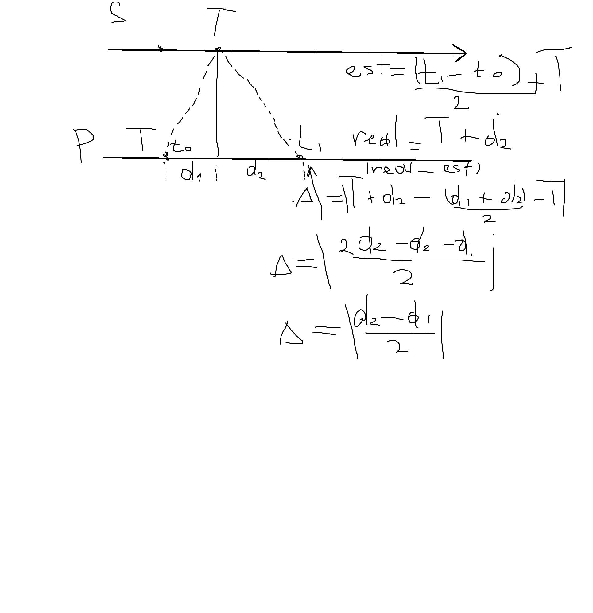

# Вопросы

## К заданию 1

> **a. Проанализируйте результаты эксперимента: оцените с точки зрения теории и проведенного эксперимента (experiment.png), в каком диапазоне может лежать
относительная ошибка синхронизации в алгоритме Кристиана?**

Пусть 
a это задержка запроса (request)
b это задержка ответа (response). 

Клиент отправляет запрос в момент t0, получает ответ в момент t1. 

T это показание удалённых часов в момент приёма запроса  

Тогда  
T = t0 + skew + a
где skew - расхождение часов сервера и клиента в момент t0.

Алгоритм Кристиана даёт оценку удалённого времени в момент приёма ответа:
estimated = T + (a + b) / 2

Истинное удалённое время в тот же момент:
true = T + b

Абсолютная ошибка:
estimated − true = (a + b)/2 − b = (a − b)/2

skew сокращается. Начальное расхождение часов на точность не влияет - важна только асимметрия каналов.

Относительная ошибка по определению:
relative_error = |(estimated − true) / true| = |a − b| / (2 · (T + b))
Диапазон
Минимум равен нулю. Достигается при a = b — симметричном канале. Тогда числитель |a − b| = 0, и вся дробь обращается в ноль.

Максимум - асимптотический, равен 0.5. 
Чтобы это увидеть, введём коэффициент асимметрии ratio = a / b (как в эксперименте). 
Тогда a = ratio · b, и формула принимает вид:

relative_error = b · |ratio − 1| / (2 · (T + b))
При ratio стремящемся к бесконечности (на графике это ось X вправо) числитель растёт пропорционально b · ratio, но и T растёт вместе с a, 
поскольку T = skew + a - то есть знаменатель тоже растёт пропорционально b · ratio. После сокращения получаем:

 
Предел при  ratio к бесконечности равен (relative_error) = 1/2
 
График полностью подтверждает теорию: относительная ошибка лежит в диапазоне [0, 0.5), ноль достигается на симметричном канале, а половина — асимптотический предел при бесконечной асимметрии.

> **b. Верно ли, что из-за возможно большой относительной ошибки алгоритма его применение
на практике может быть затруднительно (высокая неточность)? Докажите или опровергните это
с помощью, например, аналитического вывода или контрпримера.**

В реальных системах большой знаменатель получается в формуле расчета относительной ошибки.

И задержка реальной сети это миллисекунды обычно (10*3 микросекунд)

А текущее юникс время 1789109294

То есть с абсолютной ошибкой 50 мс, получим 
юникс время перевели в микросекунды, ошибку тоже

relative_error = 5 × 10⁴ / 1.789 × 10¹⁵ ≈ 2.8 × 10⁻¹¹
а вот это очень мало реально 0.0000000028% типа

> **c. Оцените ошибку синхронизации с сетевой задержкой при запросе d_1 и сетевой задержке при ответе d_2, а также найдите ее численное значение для d_1 = 40 ms, d_2 = 80 ms.** 

> *Примечание: Разницу в drift (то есть в тактовой частоте) между часами можно принять пренебрежимо малой.*
 
Алгоритм Кристиана оценивает удалённое время в момент прихода ответа как:
    estimated = T + (t_1_ − t_0_)/2 = T + (d1 + d2)/2
Истинное удалённое время в этот же момент
Не считаем d1, так как локальные часы тоже на d1 сдвинулись
    true = T + d2
Абсолютная ошибка
Δ = estimated − true = (d1 + d2)/2 − d₂ = (d1 − d2)/2

ошибка по модулю получается (80-40)/2=20 ms
Приложена еще картинка с выводом в      

## К заданию 2

> **a. Верно ли, что сортировка последовательности временных меток, соответствующих векторным часам, существует всегда? Покажите, как свести задачу к понятию топологической сортировки графа.**

 Да, сортировка существует всегда. Отношение «произошло до» для векторных часов является строгим частичным порядком: оно иррефлексивно, антисимметрично и транзитивно, а значит, ациклично. Любое конечное множество с частичным порядком допускает линейное расширение.

Задача сводится к топологической сортировке: строится ориентированный граф, где вершины - события, а рёбра (a, b) соответствуют отношению a -> b. Поскольку граф ацикличен, для него существует топологическая сортировка. Наша функция partial_sort реализует алгоритм Кана: находит вершину без входящих рёбер, добавляет её в результат, удаляет и повторяет. Результат не единственный - конкурентные события можно переставлять произвольно, что и отражено в названии "частичная сортировка"

> **b. Верно ли, что если сортировка последовательности временных меток, соответствующих векторным часам, существует, то она единственна? Является ли она в таком случае тотально упорядоченной? Сформулируйте и докажите (в две стороны) необходимое и достаточное условие единственности частичной сортировки.**

Нет, если сортировка существует, то из этого не следует, что она единственная (можем переставлять конкурентные события между собой)
Нет, она не является тотально упорядоченной. При этом она будет тотально упорядоченной, если является единственной (нет конкурентных событий)

Необходимое и достаточное условие:
Пусть S — конечное множество векторных часов, и пусть → — отношение «произошло до» на них.
Частичная сортировка S единственна тогда и только тогда, когда для любой пары различных A, B ∈ S выполнено A → B или B → A.
Иными словами: сортировка единственна, когда нет конкурентных пар

1) Достаточность
Пусть все пары часов в множестве сравнимы, но есть вторая сортировка. N1 N2 Nk Nm... N1 N2 Nm Nk..N, где Nm and Nk поменяны местами. Но между ними существует только
одно верное сравнение произошло до, значит верна только одна сортировка.

2) Необходимость 
Пусть у нас есть отсортированное множество векторных часов. И 2 элемента являются конкурентными. Тогда мы можем их поменять местами не нарушин сортировку,
но получается, что сортировка не единственна таким образом.

> **c. Предложите (теоретическое описание и идею, код не требуется) алгоритм для подсчета количества всевозможных корректных сортировок последовательности векторных часов.**

Выбираем часы, которые могут стоять первыми, потом выбираем часы, которые могут стоят вторыми и так далее. Потом вернулись на два шага назад с конца, посмотрим
не могли ли мы выбрать другие часы и так далее возвращаемся собирая все цепочки(динамическое программирование). Для небольших множеств приемлимо так перебрать.

> **d. Оцените временную сложность реализованного вами в задании алгоритма, принимая за параметр N количество процессов системы (соответственно, размер векторных часов), 
и за параметр M количество векторных часов на входе.**

> *Подсказка: оцените количество сравнений векторных часов в вашем алгоритме и умножьте
эту оценку на сложность сравнения пары векторных часов. Временной сложностью является
выражение вида O(...).*

happens_before стоит O(N) — один проход по всем ключам двух векторов 

На каждой итерации while внешний цикл перебирает до M кандидатов, для каждого — до M проверок через any, каждая O(N). Итого O(M² · N) на итерацию в худшем случае 

Цикл while выполняется M раз → O(M³ · N) 